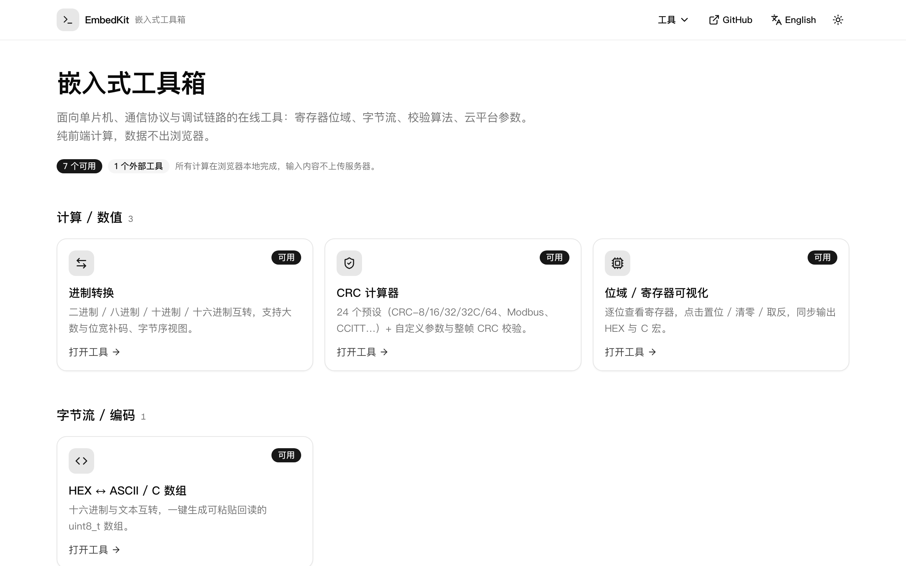

# EmbedKit · 嵌入式工具箱

面向嵌入式开发的在线工具集：寄存器位域、字节流、校验算法、协议帧、云平台参数。
**所有计算都在浏览器本地完成，输入内容不上传服务器。**

[](https://vercel.com/new/clone?repository-url=https%3A%2F%2Fgithub.com%2FLab0x-Embedded%2Fembedkit)



## 工具清单

七个工具全部可用，首页没有灰色占位卡。

| 分类 | 工具 | 说明 |
| --- | --- | --- |
| 计算 / 数值 | **进制转换** `/tools/base-converter` | 2 / 8 / 10 / 16 互转，BigInt 大数、位宽补码解释、大小端字节序视图 |
| 计算 / 数值 | **CRC 计算器** `/tools/crc` | 24 个预设（CRC-8/16/32/32C/64，Modbus、CCITT、AUTOSAR、Castagnoli…）+ 自定义 poly / init / refin / refout / xorout；HEX 模式下粘贴整帧还会校验尾部 CRC |
| 计算 / 数值 | **位域 / 寄存器可视化** `/tools/bitfield` | 8 / 16 / 32 / 64 位网格，点击置位 / 清零 / 取反，字段切片并导出 C 宏 |
| 字节流 / 编码 | **HEX ↔ ASCII / C 数组** `/tools/hex-ascii` | 文本 / HEX / C 数组三向互转，UTF-8 与 Latin-1，生成可回读的 `uint8_t` 数组与 xxd 风格 hexdump |
| 协议 / 通信 | **Modbus 报文生成与校验** `/tools/modbus-frame` | 8 个常用功能码，RTU（自动补 CRC16）与 TCP（自动补 MBAP 头）；也能把收到的帧拆成字段并校验 CRC |
| 协议 / 通信 | **串口监视器** `/tools/serial` | 浏览器直连串口（Web Serial）：HEX / 文本 / ANSI 彩色日志、分包合并、定时发送、快捷指令、拔插自动重连 |
| 云平台 / 配置 | **OneNET MQTT 参数生成** `/tools/onenet-mqtt` | ClientID / Username / Password 签名、物模型 Topic、ESP-AT 指令序列 |

> 串口监视器需要桌面版 Chrome / Edge（Web Serial 不支持 Safari、Firefox），
> 且必须在 https 或 localhost 下使用。查到的串口只能由你手动授权，页面不会主动打开设备。

## 技术栈

Next.js 16（App Router / Turbopack）· React 19 · TypeScript · Tailwind CSS v4 ·
shadcn/ui（radix-nova 预设）· next-intl（中英双语）· @wrksz/themes ·
js-crc（CRC 模型目录）· Vitest · pnpm

## 本地开发

```bash
pnpm install
pnpm dev            # http://localhost:3000 → 自动跳 /zh
```

提交前跑齐四条（CI 也是这四条）：

```bash
pnpm lint && pnpm typecheck && pnpm test && pnpm build
```

## 部署（Vercel）

[](https://vercel.com/new/clone?repository-url=https%3A%2F%2Fgithub.com%2FLab0x-Embedded%2Fembedkit)

普通 Next.js 应用：**没有环境变量、没有数据库、没有后端**，点上面的按钮直接部署，不用改任何配置。

部署已有仓库：打开 <https://vercel.com/new> 选 `Lab0x-Embedded/embedkit`，Framework Preset 会自动识别成
Next.js，Root Directory / Build Command / Output Directory 全部保持默认。之后 `git push origin main` 触发生产部署。

绑定自定义域名：Vercel 项目 → Settings → Domains 添加域名 → DNS 加一条 CNAME 指向 `cname.vercel-dns.com`。

## 参与开发

目录结构、代码约定、本地开发的坑（其中一个是会伪装成 RSC 报错的 Service Worker 冲突）、
当前进度与后续计划，都在 [`.claude/skills/embedkit-dev/SKILL.md`](./.claude/skills/embedkit-dev/SKILL.md)。

## License

[MIT](./LICENSE) © 2026 Ryanuo · Lab0x-Embedded
